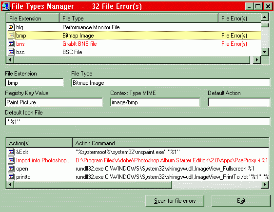



## File Type Manager

### Description

File Types Manager retrieves all registered file extensions

from the Windows registry and presents them along with the

file type, registry key value, context type, default action,

default icon file and all action commands. A scan for verifying

action files is also available.
 
### More Info
 

             |
---                |---
**Submitted On**   |2007-03-25 17:20:50
**By**             |[dlsoftware\-us](https://github.com/Planet-Source-Code/PSCIndex/blob/master/ByAuthor/dlsoftware-us.md)
**Level**          |Intermediate
**User Rating**    |5.0 (15 globes from 3 users)
**Compatibility**  |VB 6\.0
**Category**       |[Files/ File Controls/ Input/ Output](https://github.com/Planet-Source-Code/PSCIndex/blob/master/ByCategory/files-file-controls-input-output__1-3.md)
**World**          |[Visual Basic](https://github.com/Planet-Source-Code/PSCIndex/blob/master/ByWorld/visual-basic.md)
**Archive File**   |[File\_Type\_2056063252007\.Zip](https://github.com/Planet-Source-Code/dlsoftware-us-file-type-manager__1-68213/archive/master.zip)

